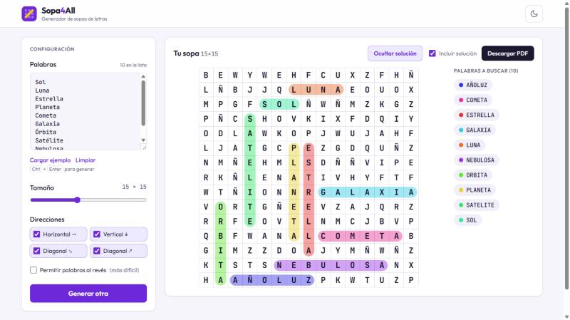
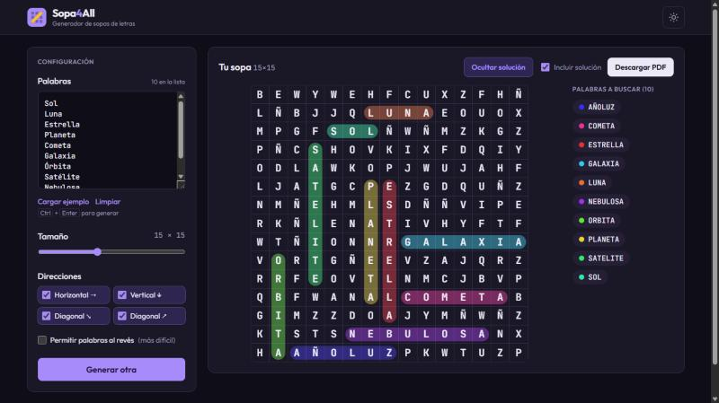
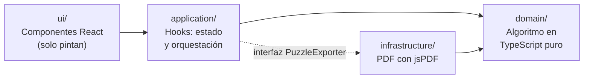

# Sopa4All

[](https://github.com/JuanC67811/sopa4all/actions/workflows/deploy.yml)

Generador de sopas de letras personalizadas: escribe tu lista de palabras, elige tamaño y direcciones, y obtén una sopa lista para jugar en pantalla o imprimir en PDF.

**[Probar la demo →](https://sopa4all.rifas4all.workers.dev)** · [copia en GitHub Pages](https://juanc67811.github.io/sopa4all/)

| Modo claro | Modo oscuro |
| --- | --- |
|  |  |

## Funcionalidades

- Cuadrícula configurable de 5×5 a 30×30 (15×15 por defecto).
- Palabras en horizontal, vertical y en las dos diagonales, con opción de colocarlas al revés.
- Soporte completo del español: quita tildes y diéresis pero conserva la **Ñ**.
- Solución visual: cada palabra se marca con una línea de color, como con un rotulador.
- Exportación a **PDF vectorial** (nítido al imprimir), con página de solución opcional.
- Avisos claros cuando una palabra se descarta (repetida, demasiado larga, con símbolos) o no cabe.
- Modo claro y oscuro, diseño adaptable a móvil y atajo `Ctrl + Enter` para generar.

## Tecnologías

React 19 · TypeScript · Vite · Tailwind CSS 4 · Vitest · Testing Library · jsPDF · GitHub Actions · Cloudflare Workers

## Arquitectura

El código está dividido en capas con dependencias en una sola dirección. La lógica del juego no sabe que existe React, y la interfaz no sabe que el PDF se hace con jsPDF.



| Capa | Responsabilidad | Depende de React |
| --- | --- | --- |
| `domain/` | Normalizar palabras, colocarlas, rellenar la cuadrícula, calcular la solución | No |
| `application/` | Hooks que guardan el estado y conectan la UI con el dominio | Sí |
| `infrastructure/` | Detalles reemplazables: la exportación a PDF | No |
| `ui/` | Componentes que reciben props y pintan; tema claro/oscuro | Sí |

`App.tsx` es el único lugar que elige la implementación concreta del exportador (`jsPdfExporter`) y se la pasa al hook `usePdfExport`, que solo conoce la interfaz `PuzzleExporter` (inversión de dependencias).

## Cómo funciona el algoritmo

1. **Normalizar**: mayúsculas, sin espacios ni tildes (conservando la Ñ). Se descartan duplicados, palabras con símbolos y las más largas que la cuadrícula.
2. **Ordenar de más larga a más corta**: las largas son las difíciles de ubicar y entran con la cuadrícula vacía.
3. **Enumerar todos los candidatos** para cada palabra (fila, columna, dirección y sentido) que caben dentro de los límites.
4. **Barajar los candidatos** (Fisher-Yates) y colocar la palabra en el primero en el que cada celda esté vacía o tenga la misma letra (un cruce).
5. **Rellenar** las celdas vacías con letras al azar.
6. **Validar**: si alguna palabra no cupo o aparece más de una vez (por ejemplo, el relleno formó otro "SOL" por casualidad), se reintenta hasta 20 veces y se conserva el mejor resultado.

Al enumerar los candidatos en lugar de probar posiciones al azar "hasta que funcione", el algoritmo **siempre termina**, incluso cuando una palabra no cabe.

## Decisiones técnicas

- **Aleatoriedad inyectable**: las funciones del dominio reciben la función aleatoria como parámetro. En la app es `Math.random`; en los tests, un generador con semilla, así los tests son reproducibles.
- **La solución no es una segunda cuadrícula**: es la lista de `placements` (inicio, dirección, sentido). La pantalla y el PDF calculan las líneas a partir de ella con la misma función.
- **PDF dibujado, no capturado**: en lugar de convertir la pantalla en imagen (borrosa al imprimir), el PDF se dibuja con texto y líneas vectoriales.
- **Carga diferida de jsPDF**: la librería (~400 KB) solo se descarga al pulsar "Descargar PDF".
- **Design tokens**: los colores son variables CSS con nombre semántico (`surface`, `muted`, `brand`…). El modo oscuro solo cambia sus valores, sin tocar los componentes.
- **El generador nunca lanza errores**: devuelve la sopa junto con las palabras descartadas y las que no cupieron, y la interfaz decide cómo informarlo.

## Ejecutar en local

Requisitos: Node.js 20 o superior.

```bash
git clone https://github.com/JuanC67811/sopa4all.git
cd sopa4all
npm install
npm run dev
```

| Comando | Qué hace |
| --- | --- |
| `npm run dev` | Servidor de desarrollo en http://localhost:5173 |
| `npm run test` | Tests en modo observador |
| `npm run lint` | Linter (oxlint) |
| `npm run build` | Compila la versión de producción en `dist/` |
| `npm run deploy` | Compila y publica en Cloudflare Workers (requiere `wrangler login`) |

## Tests

Más de 70 tests con Vitest y Testing Library cubren el dominio (normalización, colocación, relleno, ambigüedad), los hooks, la maquetación del PDF y la app completa simulando a un usuario. GitHub Actions ejecuta lint, tests y compilación en cada push y publica una copia en GitHub Pages. La versión principal se publica en Cloudflare Workers con `npm run deploy`.

## Estructura

```
src/
├── domain/            # Algoritmo puro: modelos, normalización, colocación, relleno, solución
├── application/       # Hooks (usePuzzleGenerator, usePdfExport) e interfaz PuzzleExporter
├── infrastructure/
│   └── pdf/           # Exportador con jsPDF y cálculo de la maquetación
├── ui/
│   ├── components/    # Componentes de la interfaz
│   └── hooks/         # useTheme (modo claro/oscuro)
└── App.tsx            # Compone todo y elige las implementaciones concretas
```

## Autor

**Juan Carlos Martínez** · [GitHub](https://github.com/JuanC67811)
